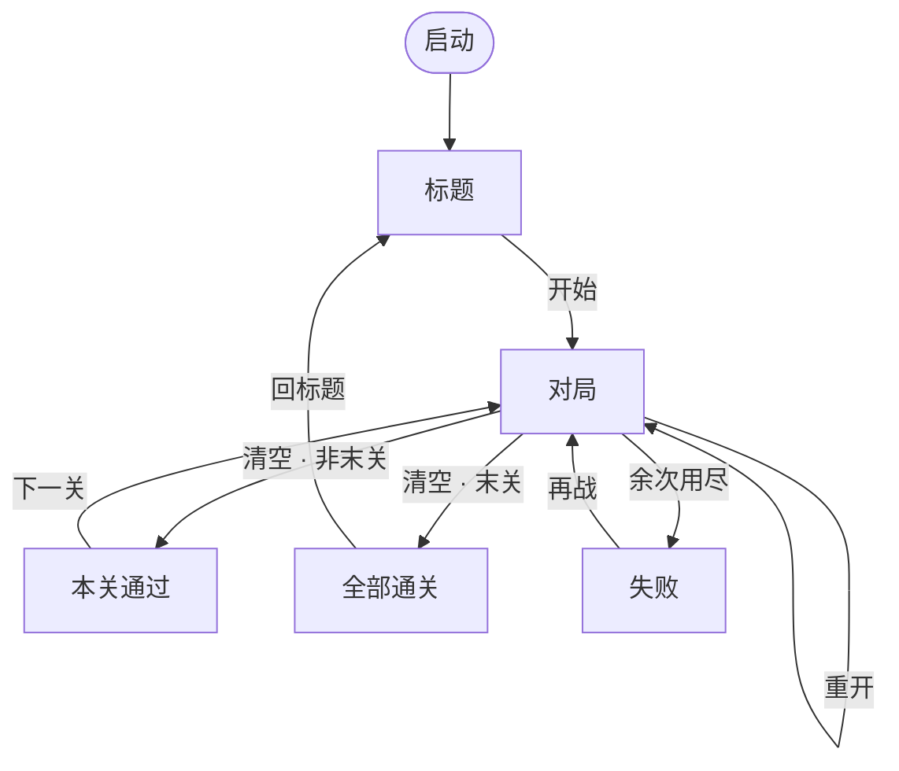

# 一箭又一箭 · 策划案

| | |
|---|---|
| 类型 | 点击解谜 |
| 平台 | Python · Pygame 2 |
| 一局时长 | 约 1–3 分钟 / 关 |
| 关卡数据 | [levels.md](levels.md) |
| 表现层接口 | [pygame.md](pygame.md) |
| 课程过程（PSP / AIGC / 对照与自测） | [process.md](process.md) |

---

## 1. 概述

棋盘上摆着朝上、下、左、右的箭头。玩家点一支箭，它就沿自己的方向飞；飞出界外则消失，撞上别的箭则弹回。清空一盘即过关。乐趣来自**读序**：谁挡着谁，必须先放谁走。

**核心循环：** 观察阻挡 → 点选 → 飞出或受阻 → 盘面变稀 → 再观察。

手感目标：点下去立刻有结果；飞出要看得出方向；撞上要看得出「这条路被占了」。界面只保留对局必需信息：关名、余箭、余次、重开。

---

## 2. 规则

### 2.1 盘面

| 项 | 约定 |
|---|---|
| 空间 | 矩形网格，一行一列对齐 |
| 占用 | 一格至多一支箭；箭只占一格 |
| 朝向 | 上 / 下 / 左 / 右，沿行列飞，不走斜线 |
| 坐标 | 左上为 (0,0)，行向下、列向右 |

### 2.2 点击结算

每次点中一支箭，沿其朝向做**格子射线**（从邻格走到盘外）：

| 射线结果 | 盘面 | 资源 | 表现 |
|---|---|---|---|
| 一路空到边界 | 该箭移除 | 余箭 −1 | 沿朝向滑出并淡出 |
| 先碰到另一支箭 | 位置不变 | 余次 −1 | 变色、短晃、提示「受阻」 |

空白格、按钮以外的区域不结算。射线只认「同向格子里有没有箭」，不认像素重叠。

### 2.3 胜负与重开

| 条件 | 结果 |
|---|---|
| 余箭为 0 | 本关通过；若还有后关则进入下一关，否则全通 |
| 余次为 0 | 本关失败，可按本关开局再战 |
| 对局中重开 | 箭头与余次回到**进入本关时**的快照，不是上一次点击前 |

余次按关配置（见关卡表）。表现播放期间不接受新的点选，避免一次按下打出两次结算。

### 2.4 操作

| 输入 | 行为 |
|---|---|
| 左键 · 箭 | 结算该箭 |
| 左键 · 重开 | 恢复本关快照 |
| 左键 · 开始 / 下一关 / 再战 | 切场景 |
| 关闭窗口 | 退出 |

### 2.5 可解盘面

同一行里「右箭在左箭左边」、同一列里「下箭在上箭上边」，两支箭永远互相挡住，这种盘面不上线。关卡用数据文件描述，程序读表，不把坐标写死在规则里。

---

## 3. 流程与界面

| 画面 | 内容 |
|---|---|
| 标题 | 名字、三行规则、开始 |
| 对局 | 顶栏（关、余箭、余次）+ 棋盘 + 重开 |
| 通过 / 全通 | 文案 + 下一关或回标题 |
| 失败 | 文案 + 再战 |

棋盘居中，按钮不压格子。箭头程序绘制（三角+箭身），中文走系统字体（Windows：微软雅黑）。配色深底浅箭，受阻用红色闪一下即可。

---

## 4. 判定

方向增量：上 `(-1,0)`，下 `(1,0)`，左 `(0,-1)`，右 `(0,1)`。

从箭所在格走出一步后开始扫：格子仍在盘内则看是否占用，占用即阻挡；越出盘边仍未占用则可飞。必须**先问格子在不在盘内，再读占用**——先按下标再判断时，负行/负列会绕到网格另一头，边缘朝外的箭会判错。

结算发生在规则层，动画只表现已经发生的结果。单次扫描长度不超过该行或该列的格数。

---

## 5. 关卡内容

关卡曲线、布局和参考解法见 [levels.md](levels.md)。首发 8 关：教程 L0 + 正式 L1–L3 + 扩展 L4–L7（大盘、更深依赖、更多分支）；余次、尺寸、箭数、`par_time`、`solution` 都是表里的字段，加关只加数据。

---

## 6. 结构与增量

**结构。** 主循环按「取输入 → 推进时间 → 画一帧」走。规则（盘面、射线、余次、关卡快照）与绘制（格子换算、动画、按钮）分开，规则不引用显示库，便于先测判定再挂画面。画面用少量场景切换：标题 / 对局 / 结果。这不是把桌面程序的 MVC 硬套进帧循环，而是解谜小游戏里常见的「状态机 + 规则/表现分离」。

**过程。** 按可玩切片往前推：每一片结束时玩家能多做一件完整的事，而不是多一个尚未接通的模块。

### 增量需求

| 增量 | 切片目标 | 必须交付 | 完成标准（可玩） |
|---|---|---|---|
| **I1 看得见、点得着** | 验证格子空间和点选 | 窗口；标题进入对局；按数据画出网格与四向箭；左键命中格子并有选中反馈 | 能打开游戏，点到箭、点不到空白，关名与棋盘同时出现 |
| **I2 核心循环** | 验证「飞出 / 受阻」手感 | 四向射线；空路移除；挡路不移除并扣余次；顶栏余箭/余次；飞出滑动、受阻晃动 | 边缘朝外的箭能飞走且不崩溃；挡住的箭扣次并留在原处；次数显示跟手 |
| **I3 关卡闭环** | 验证一局完整命运 | 至少教程+三关读表加载；清空进下一关；余次耗尽进失败；重开恢复开局快照；通过/失败画面 | 按关卡文档中的参考顺序能通关；乱点耗尽后能再战；中途重开与开局一致 |
| **I4 可交付** | 验证稳定与说明 | 对核心循环做回归（手工或自动）；运行说明与截图 | 第三人按说明能装能玩；已知路径与余次问题已关掉 |

依赖：I2 接在 I1 的命中结果上结算；I3 只替换关卡数据源与胜负跳转，不改射线；I4 不新增玩法。扩展能力若做，挂在 I3 之后，作为可选增量，不阻塞 I4。

---

## 7. 扩展功能

对照 job_description §7，后续可接、且不改核心循环：

| 扩展功能（§7） | 接法 | 难度 | 状态 |
|---|---|---|---|
| 更多关卡 / 关卡选择 | levels.json 加条目 + 标题加关卡选择 | 低 | ✅ 完成（8 关 + 选关界面） |
| 提示功能 | 用 `Session.can_fly` 扫出可飞箭并高亮 | 低 | 待做 |
| AI 自动求解 | 依赖图 + 拓扑排序（solver.py） | 低–中 | ✅ 完成（E1） |
| 撤销上一步 | 结算历史栈，每步存盘面快照 | 中 | ✅ 完成（E2） |
| 得分 / 计时 / 星级 | HUD 加字段，结果按余次/用时给星 | 低–中 | ✅ 完成（E4） |
| 音效 | `pygame.mixer` 飞出 / 受阻各一短音 | 低 | 待做（P2） |
| 保存游戏进度 | 关卡 / 进度写本地 JSON | 中 | ✅ 完成（E5） |
| 随机生成可通关关卡 | 生成后跑求解验可解 | 中–高 | 待做 |
| 打包可执行文件 | `pyinstaller --onefile` | 低 | 待做（Release） |

求解已由 solver.py 落地（依赖图 + 拓扑排序）；提示可直接复用 `Session.can_fly`。基础对局不依赖上述接口是否存在。
